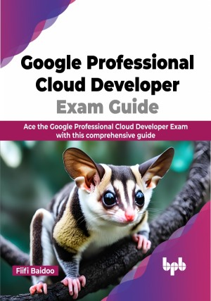

# Google Professional Cloud Developer Exam Guide

Get the knowledge and skills you need to become a certified Google Cloud Developer

This is the repository for [Google Professional Cloud Developer Exam Guide
](https://bpbonline.com/products/google-professional-cloud-developer-exam-guide?variant=42967314071752),published by BPB Publications.

## About the Book
The Google Professional Cloud Developer Exam Guide is a comprehensive study guide for the Google Professional Cloud Developer exam. It covers all the topics you need to master to design, develop, deploy, and manage cloud-native applications on Google Cloud Platform (GCP).

The book starts with an introduction to the certification and the skills and knowledge you need to pass the exam. Then, it covers the different development environments for GCP development, the most important GCP products and services, and the principles of designing high-performance and secure applications. The book also covers designing and building cloud-native applications, different application deployment strategies, and how to deploy apps and services on GCP. It also shows how to integrate applications with GCP services and how to monitor and manage app workloads. To help you prepare for the exam, the book ends with a chapter of quiz solutions.

Overall, this book is a great resource for anyone preparing for the Google Professional Cloud Developer exam.

## What You Will Learn
• Learn about the basics of cloud computing, including Infrastructure as a Service (IaaS), Platform as a Service (PaaS), and Software as a Service (SaaS).

•  Learn about serverless architectures and how to use them to build scalable and reliable applications.

•  Learn how to debug and profile code to improve its performance and reliability.

•  Learn about source control management and how to use it to track changes to code.

•  Learn about performance testing and how to use it to ensure that applications meet their performance requirements.

•  Learn about service-level agreements (SLAs), service-level objectives (SLOs), and service-level indicators (SLIs) and how to use them to measure the performance of applications.
